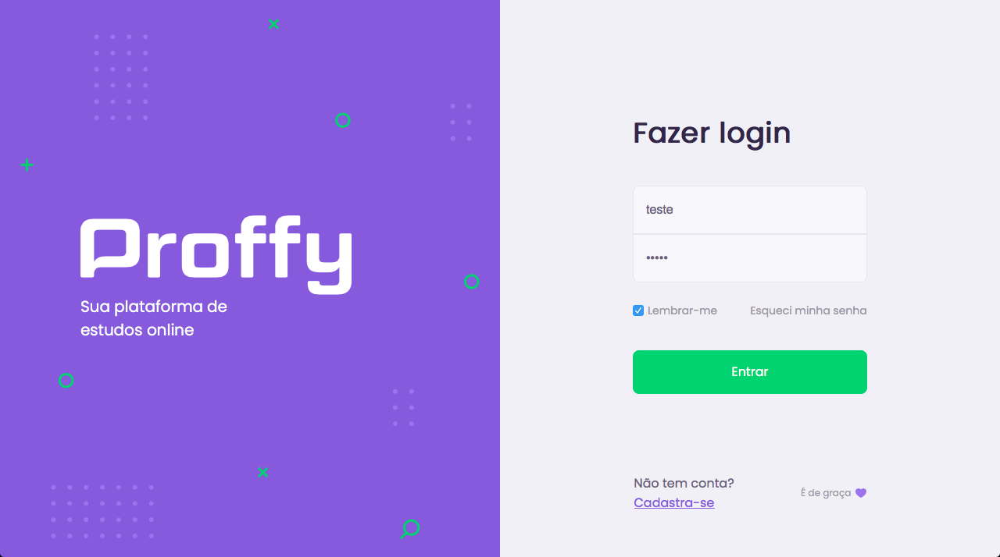
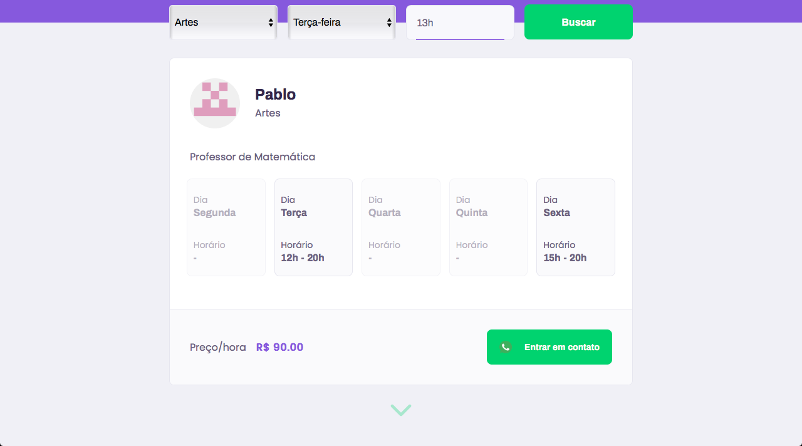
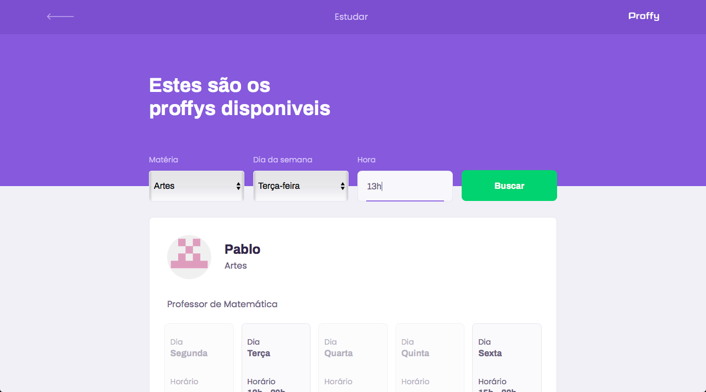
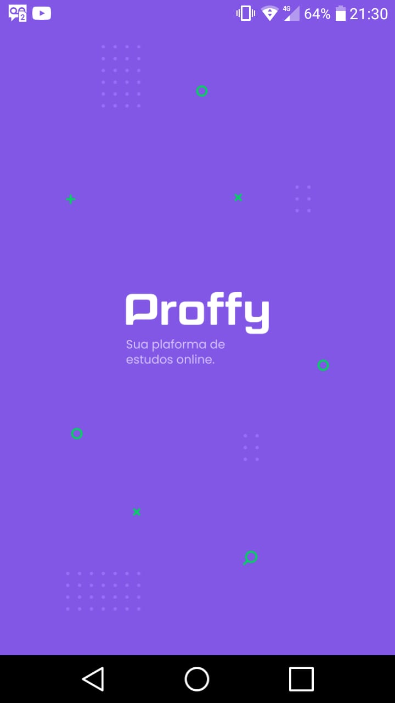
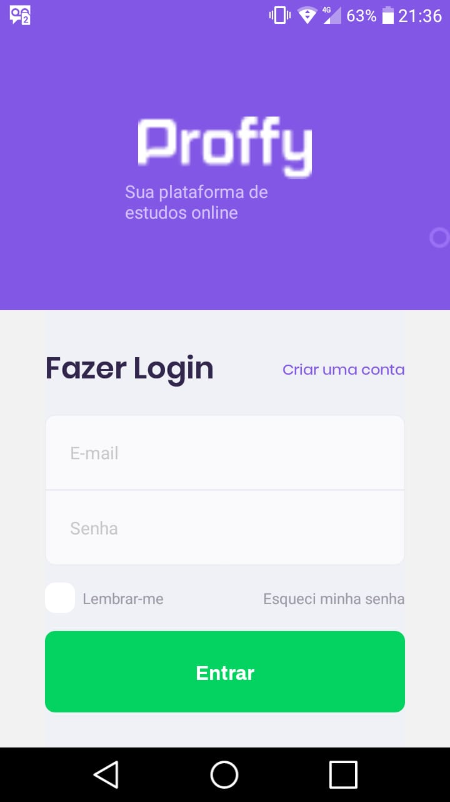
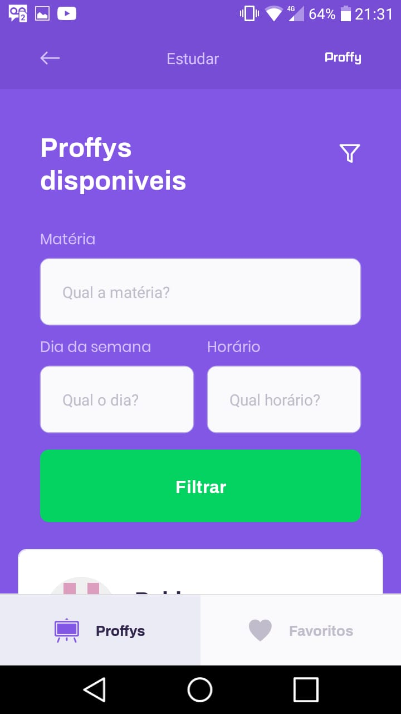

<p align="center">
   
</p>

<p align="center">

   <a href="https://www.linkedin.com/in/pablo-rosa-68136a1b2/">
      
   </a>
  

  <a aria-label="Completed" href="https://nextlevelweek.com/episodios/omnistack/edicao/2">
    </img>
  </a>

  <a href="https://github.com/PabloRSantos/proffy/commits/master">
    
  </a>

</p>

> :rocket: Projeto feito para conectar professores e estudantes, feito na NLW #2 @Rocketseat


<div align="center">
  <sub>NLW #2 projeto. feito com ❤︎ por
    <a href="https://github.com/PabloRSantos">Pablo Rosa</a>
  </sub>
</div>

# :pushpin: Índice

- [Sobre](#sobre)
- [Tecnologias Utilizadas](#tecnologias-utilizadas)
- [Como Usar](#como-usar)
- [Como Contribuir](#como-contribuir)

<a id="sobre"></a>

## :bookmark: Sobre

O <strong>Proffy</strong> é uma aplicação Web e Mobile para conectar professores e estudantes.

Essa aplicação foi construída na trilha <strong>Booster</strong> da <strong>Next Level Week</strong> distribuída pela [Rocketseat](https://rocketseat.com.br/). 

<a id="tecnologias-utilizadas"></a>

## :rocket: Tecnologias Utilizadas

O projeto foi desenvolvido utilizando as seguintes tecnologias

- [TypeScript](https://www.typescriptlang.org/)
- [Node.js](https://nodejs.org/en/)
- [ReactJS](https://reactjs.org/)
- [React Native](https://reactnative.dev/)

### Projeto Web
<div>
   
   
   
   
   
   
   
</div>

### Projeto Mobile
<div>
   
   
   
   
   
   
   
   
   
</div>

# :eyes: Link Website
Você pode acessar o website em:   
👉  https://proffy-rafa.netlify.app/ 

[](https://app.netlify.com/sites/proffy-rafa/deploys)      


# :construction_worker: Como executar
  ### **Pré-requisitos**

  - É **necessário** possuir o **[Node.js](https://nodejs.org/en/)** instalado na máquina
  - Também, é **preciso** ter um gerenciador de pacotes seja o **[NPM](https://www.npmjs.com/)** ou **[Yarn](https://yarnpkg.com/)**.
  - Por fim, é **essencial** ter o **[Expo](https://expo.io/)** instalado de forma global na máquina

```bash
# Clone o repositório
$ git clone https://github.com/PabloRSantos/Proffy.git
```
### 📦 Execute a api

```bash
# Entre na pasta server
$ cd Proffy/server

# Instale as depêndencias
$ yarn install

# Execute a aplicação
$ yarn dev
```
Acesse a API em http://localhost:3333/

### 💻 Execute o projeto web

```bash
# Entre na pasta web
$ cd Proffy/web

# Instale as depêndencias
$ yarn install

# Execute a aplicação
$ yarn dev
```
Vá para http://localhost:3000/ para ver o resultado.

### 📱 Executando projeto mobile
Para executar o projeto mobile você precisa de um celular com o aplicativo [expo](https://play.google.com/store/apps/details?id=host.exp.exponent) instalado ou um emulador android/ios.
<br />

```bash
# Entre na pasta mobile
$ cd Proffy/mobile

# Instale as depêndencias
$ yarn install

# Execute a aplicação
$ yarn start
```
Depois leia o QRCode com seu app [expo](https://play.google.com/store/apps/details?id=host.exp.exponent) ou execute pelo emulador.


## :tada: Como contribuir

- Faça um Fork desse repositório,
- Crie uma branch com a sua feature: `git checkout -b my-feature`
- Commit suas mudanças: `git commit -m 'feat: My new feature'`
- Push a sua branch: `git push origin my-feature`

## :mortar_board: Quem ministrou?

As aulas foram ministradas pelo mestre **[Diego Fernandes](https://github.com/diego3g)** nas aulas da **Next Level Week**.

## :memo: License

Esse projeto está sob a licença MIT. Veja o arquivo [LICENSE](LICENSE.md) para mais detalhes.

---

<h4 align="center">
    Feito com 💜 by <a href="https://www.linkedin.com/in/pablo-rosa-68136a1b2/" target="_blank">Pablo Rosa</a>
</h4>
